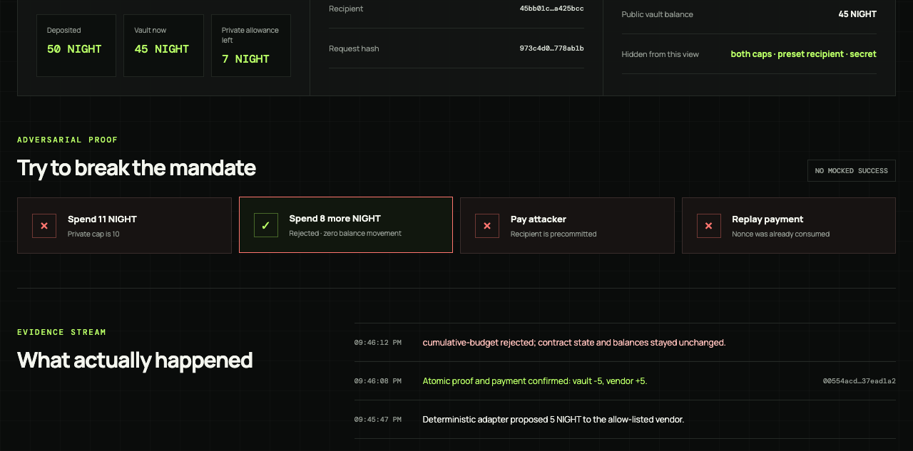

# Midnight Mandate

**Private spending rules. Atomic agent payments.**

[](https://github.com/lgoyal6/midnight-mandate/actions/workflows/verify.yml)

Midnight Mandate is a contract-custodied NIGHT vault for delegated AI-agent payments. An agent may propose a payment, but the vault releases funds only when the same Compact circuit proves that the exact amount, recipient, and running spend satisfy a privately committed mandate.



## The 30-second version

A normal server can hide a spending policy but can secretly bypass it. A transparent smart contract can enforce a policy but publishes it. Midnight Mandate keeps both the per-payment and cumulative caps plus the preconfigured recipient off the public ledger while proving that each withdrawal follows them.

The contract—not the agent—holds the funds. `agent_pay` opens the private policy through witnesses, checks the amount, recipient, and cumulative spend, consumes a replay nullifier, debits the vault, and calls `sendUnshielded` in one transaction. If any check fails, no payment or contract-state mutation occurs.

This prototype provides **private mandate enforcement with public unshielded settlement**. It does not claim private payment amounts or recipients.

## Verified status

| Evidence | Result |
| --- | --- |
| Compact | Compiler `0.31.1`, language `0.23`; three impure circuits compile |
| Simulator | 17/17 policy, custody, cumulative-budget, recovery, replay, rejection, and public-projection tests pass |
| Proposal boundary | 12/12 strict schema, alias, amount, hash, and client-binding tests pass |
| Local settlement | Vault `50 → 45`; vendor balance `+5` in a real proved transaction |
| Recovery | A distinct owner-secret proof recovered the remaining `45`; vault `45 → 0` and permanently closed |
| Attacks | Over-cap, cumulative-budget, wrong-recipient, replay, and post-close payment reject with unchanged balances/state |
| Reproducibility | `yarn demo:smoke` compiles, tests, deploys, funds, pays, attacks, and recovers in one command |
| UI | Real API flow and browser rendering verified; no Vite overlay or console errors |
| Public projection | Isolated `/observer` contains no private ceilings, remaining allowance, preset address, policy secret, or instruction |
| Preprod | Runner and network reachability verified; transaction remains gated by a team-owned funded test wallet |

Latest checked-in local evidence is in [`evidence/local-smoke.json`](evidence/local-smoke.json). Preprod is not claimed until [`docs/PREPROD.md`](docs/PREPROD.md) records a successful public transaction.

The frozen install, full verification gate, and smoke test were also rerun successfully from a clean public GitHub clone of commit `366e0a3`. The independent Linux CI gate passed on the same commit.

## Architecture

```text
Owner private state              Agent proposal                 Public ledger
policy + owner secrets,          amount, alias, purpose         policy/owner commitments
both caps, recipient                                           active flag/vault color
        │                                │                       nullifiers/receipts
        └──── witness opening ───────────┴──────┐                count/cumulative spend
                                                ▼
                              Compact agent_pay circuit
                    commitment + recipient + both caps + replay
                                                │
                                      same checked values
                                                ▼
                                  sendUnshielded recipient
```

The AI/model is deliberately outside the trust boundary. It can extract only `amount`, an allow-listed recipient alias, and `purpose`. Deterministic code selects the actual address, network, contract, token color, nonce, and request hash. The Compact contract remains the final authority.

See [`docs/ARCHITECTURE.md`](docs/ARCHITECTURE.md), [`docs/PRIVACY.md`](docs/PRIVACY.md), and [`docs/THREAT_MODEL.md`](docs/THREAT_MODEL.md).

## Public versus private

| Value | Owner/agent runtime | Public ledger/observer |
| --- | --- | --- |
| Policy secret | Yes | No |
| Owner recovery secret | Yes | No |
| Maximum per payment | Yes | No |
| Maximum cumulative spend | Yes | No |
| Preconfigured recipient before execution | Yes | No |
| Policy commitment | Derived locally | Yes |
| Owner commitment and active status | Derived/observed locally | Yes |
| Successful amount and recipient | Yes | Yes—settlement is unshielded |
| Natural-language instruction | Yes | No; only its request hash is recorded |
| Replay nullifier and receipt | Derived locally | Yes |
| Number of successful payments | Yes | Yes |
| Running cumulative spend | Yes | Yes—successful amounts are already public |

The delegated runtime supplies witnesses and therefore knows the mandate. The privacy claim concerns the public ledger and outside observers, not secrecy from the machine performing the proof.

## Quick start

Prerequisites:

- Node.js `22` or newer; verified with Node `24.19.0` and `26.8.1`.
- Yarn `1.22.22` through Corepack.
- Docker with a running daemon.
- Compact launcher `0.5.2` with compiler `0.31.1` selected.

Install and verify Compact using the [official Midnight installation guide](https://docs.midnight.network/getting-started/installation) and [support matrix](https://docs.midnight.network/relnotes/support-matrix):

```bash
curl --proto '=https' --tlsv1.2 -LsSf \
  https://github.com/midnightntwrk/compact/releases/latest/download/compact-installer.sh \
  | sh
export PATH="$PATH:$HOME/.local/bin"
compact update 0.31.1
compact --version
compact compile --version
```

Then:

```bash
corepack enable
corepack prepare yarn@1.22.22 --activate
yarn install --frozen-lockfile
yarn demo:smoke
```

A valid run ends with:

```text
MIDNIGHT_MANDATE_SMOKE_PASS
vault_delta=-5
vendor_delta=+5
cumulative_spend=5
owner_recovered=+45
vault_after_close=0
rejected=over-cap,cumulative-budget,wrong-recipient,replay,closed-vault
```

The smoke command exits nonzero if compilation/tests fail, the real payment or recovery does not move exact balances, or any attack unexpectedly succeeds.

## Run the visual demo

```bash
yarn demo:ui
```

Open [http://127.0.0.1:5173](http://127.0.0.1:5173), then:

1. Select **Initialize real vault** and wait for deploy/fund confirmation.
2. Create the default deterministic typed proposal.
3. Select **Prove & pay** and confirm vault `50 → 45` and vendor `+5`.
4. Run all four attack buttons; each must say `Rejected · zero balance movement`. The aggregate attack requests 8 after spending 5: it is under the 10-per-payment cap but exceeds the hidden total of 12.
5. Open [http://127.0.0.1:5173/observer](http://127.0.0.1:5173/observer) to inspect the isolated public-only projection.

The deterministic adapter is the reliable demo path. **Live AI · $0.01** uses a schema-guided model through the authenticated Zero runner and fails closed if that provider is unavailable; it never changes the Compact authority boundary.

## Commands

| Command | Purpose |
| --- | --- |
| `yarn compile` | Compile `contracts/mandate.compact` and generated proof artifacts |
| `yarn test:contract` | Run the Compact simulator/adversarial suite |
| `yarn test:proposal` | Run strict proposal and model-authority tests |
| `yarn verify` | Run compile, unit tests, both type checks, web build, and secret scan |
| `yarn demo:smoke` | Reproduce the complete real local proof/payment/attack/recovery story |
| `yarn demo:ui` | Start the real demo API and Vite interface |
| `yarn test:preprod` | Attempt the same deploy/deposit/pay path on Preprod with a supplied test wallet |
| `yarn env:down` | Stop this repository's Compose stack when it owns the services |

## Why this is different from nearby Midnight work

| Project | Existing contribution | Midnight Mandate distinction |
| --- | --- | --- |
| [Aegis](https://github.com/1shanpanta/aegis) | Private cap/whitelist/running-total policy proofs and reject paths | Aegis explicitly is not the vault; Mandate couples the proof to contract-held funds and atomic settlement |
| [MidPilot](https://github.com/ANPAN27/MidPilot) | Natural-language payment UX and wallet transfer path | Its active policy check is local; Mandate enforces policy inside the withdrawal circuit |
| [Latch](https://github.com/CipherCollective/Latch) | Strong private one-use capability framing | Its repository discloses that real proof/receipt/transaction operations remain pending |
| [Passport](https://github.com/midnightntwrk/passport-demo) | Official contract custody and atomic grant withdrawal pattern | Prototype grant cap/color are public and recipient unrestricted; Mandate privately commits both caps and recipient |
| [Kaelix](https://github.com/kushwahaamar-dev/Kaelix) | Private AI guard plus compliance attestation | Mandate makes the proof causal by executing the protected payment itself |

These comparisons describe the inspected public repositories, not claims about their future roadmaps.

## Known limitations

- Successful settlement uses unshielded NIGHT, exposing amount and recipient.
- One vault supports one immutable recipient, one maximum per-payment amount, and one lifetime cumulative ceiling.
- The cumulative ceiling has no epoch/day reset. The owner can recover the whole remaining balance only by permanently closing the vault.
- No expiry, policy rotation, owner-key rotation/guardians, multisig, or shielded payout yet.
- The prototype stores policy and owner witnesses in one trusted local runtime. It proves distinct secrets cryptographically but does not yet isolate owner recovery authority from a compromised proving process.
- Losing the owner secret makes recovery unavailable.
- This is prototype custody for test assets only—not audited production custody.
- Local devnet is the verified reliability baseline. Preprod is not yet claimed.

## Documentation and provenance

- [`docs/REPRODUCE.md`](docs/REPRODUCE.md) — exact teammate runbook and encountered errors.
- [`docs/DEMO.md`](docs/DEMO.md) — two-minute recording path.
- [`docs/PREPROD.md`](docs/PREPROD.md) — public-network runner and current human gate.
- [`SUBMISSION.md`](SUBMISSION.md) — prepared Devpost copy, exact two-minute script, recording runbook, and public-release gate.
- [`NEXT_STEPS.md`](NEXT_STEPS.md) — teammate onboarding, verified status, parallel work lanes, and integration rules.
- [`UPSTREAM.md`](UPSTREAM.md) — vendor lineage and event-window originality.
- [`evidence/`](evidence/) — sanitized, checked-in local receipts.

All implementation commits in this repository were created during the event window. No pre-event project code was imported.
